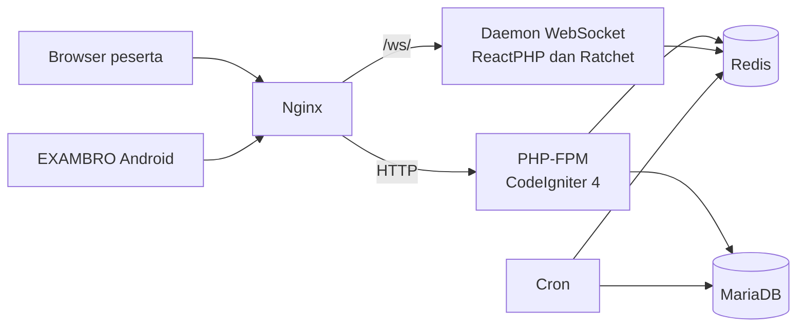

# CBT-MF


Aplikasi ujian berbasis komputer untuk sekolah dan madrasah. Dibangun di atas
CodeIgniter 4 dan berjalan sepenuhnya di dalam Docker. Dua keputusan
membedakannya dari CBT pada umumnya: komunikasi real-time ditangani daemon
WebSocket terpisah sehingga ratusan peserta serentak tidak menghabiskan worker
PHP-FPM, dan halaman soal dapat dibekukan menjadi berkas statis sehingga tahan
lonjakan akses di menit-menit pertama ujian.


## Fitur Utama

- **Bank soal enam tipe** — pilihan ganda satu jawaban, pilihan ganda kompleks,
  esai atau teks singkat, menjodohkan, benar/salah, dan mengurutkan.
- **Import dari Word** — soal ditulis di `.docx` dengan penomoran biasa, tanpa
  kode format khusus seperti `Q:` atau `RIGHT:`. Gambar yang tertanam di dokumen
  ikut terbawa.
- **Mode ujian statis** — generator yang membekukan halaman soal menjadi HTML,
  menghilangkan pekerjaan PHP per permintaan pada saat beban puncak.
- **Live proctoring** — pengawas melihat peserta yang sedang mengerjakan dan
  dapat memberi tambahan waktu, mengeluarkan, atau memblokir sesi secara
  langsung tanpa memuat ulang halaman.
- **EXAMBRO** — aplikasi Android pengunci layar untuk skema BYOD, dengan sirine
  saat peserta memaksa keluar, overlay guard, blokir clipboard, pemaksaan home
  launcher, dan deteksi perangkat ter-root atau emulator.
- **Deteksi kecurangan di browser** — peringatan otomatis saat peserta keluar
  dari fullscreen atau berpindah tab, dengan ambang pelanggaran yang diatur
  administrator.
- **Antrean slot dan rem login** — batas peserta serentak dengan halaman antrean,
  serta throttling login per-IP yang dirancang tidak menghukum sekolah di balik
  CGNAT.
- **Audit trail dan pelaporan** — riwayat aktivitas dengan daftar pengguna online
  real-time, analytics, dan export laporan ke `.xls`.

## Tampilan

### Panel administrator

| | |
| --- | --- |
|  <br> Manajemen ujian: jadwal, durasi, dan mode pelaksanaan |  <br> Import soal dari `.docx` beserta panduan formatnya |
|  <br> Kontrol pengawas: ban, reset sesi, dan reset ujian |  <br> Konfigurasi penguncian layar perangkat Android |

### Sisi peserta


Halaman mulai ujian di desktop.


Pengerjaan soal di ponsel. Tata letak menyesuaikan layar kecil, sehingga skema
BYOD dapat berjalan tanpa aplikasi terpisah.

## Instalasi

### Prasyarat

- Docker dan Docker Compose V2
- Host Linux
- Akses root — installer mengatur kepemilikan direktori ke GID 33 (`www-data`)

### Pemasangan

```bash
git clone https://github.com/rozendev/CBT-MF.git
cd CBT-MF
sudo bash scripts/cbt.sh install
```

Installer bersifat interaktif dan menanyakan nama database, username dan
password database, prefix nama container, token Cloudflare Tunnel (boleh
dikosongkan), base URL aplikasi, password Redis, serta username dan password
akun administrator pertama. Tidak ada kredensial bawaan: password admin adalah
yang Anda ketik sendiri.

Setelah pertanyaan selesai, installer menulis `.env` dan `src/.env`, membangun
dan menyalakan seluruh container, membetulkan permission direktori, menjalankan
`composer install`, menjalankan migrasi database, dan membuat akun administrator.
Tidak ada langkah manual tambahan.

### Layanan yang berjalan

| Layanan | Alamat | Keterangan |
| --- | --- | --- |
| Aplikasi (Nginx) | `http://localhost:8080` | Satu-satunya port yang terekspos ke jaringan |
| WebSocket | `127.0.0.1:8060` | Terikat ke localhost; diproksi Nginx lewat `/ws/` |
| MariaDB | — | Hanya di dalam jaringan Docker |
| Redis | — | Hanya di dalam jaringan Docker |

Untuk membuka MariaDB atau Redis, gunakan `scripts/cbt.sh db shell` dan
`scripts/cbt.sh redis shell`; keduanya tidak dipublikasikan ke host.

## Penggunaan

`scripts/cbt.sh` adalah satu-satunya pintu operasional. Dijalankan tanpa
argumen, ia membuka menu interaktif:

```bash
sudo bash scripts/cbt.sh
```

Atau langsung sebagai subperintah:

```bash
sudo bash scripts/cbt.sh <grup> <perintah>
```

| Grup | Perintah |
| --- | --- |
| `docker` | `up`, `down`, `restart`, `logs`, `status` |
| `app` | `shell`, `php`, `composer` |
| `db` | `shell`, `root`, `export`, `import`, `reset-password` |
| `redis` | `shell`, `flush` |
| `bundle` | `build`, `status` |
| `data` | `images`, `optimize`, `cache-clear`, `finalize`, `prune-kiosk` |
| `migrate` | `up`, `status`, `rollback` |
| `tune` | `show`, `set` |

Perintah tingkat atas tanpa grup: `backup`, `log-rotate`, `reset-install`,
`test-k6`, `install`, `help`.

Perintah yang merusak data (`db import`, `redis flush`, `data optimize`,
`migrate rollback`, `reset-install`) menuntut Anda mengetik ulang nama
perintahnya sebelum dijalankan.

Beberapa perintah yang sering dipakai:

```bash
sudo bash scripts/cbt.sh docker status      # periksa kondisi seluruh container
sudo bash scripts/cbt.sh docker logs        # ikuti log semua layanan
sudo bash scripts/cbt.sh backup             # backup database dan Redis
sudo bash scripts/cbt.sh db reset-password  # setel ulang password admin
sudo bash scripts/cbt.sh data finalize      # tutup attempt yang lewat batas waktu
```

Satu hal yang mudah terlewat: **setelah mengubah UI ujian, bundle kiosk wajib
dibangun ulang.**

```bash
sudo bash scripts/cbt.sh bundle build
```

Tanpa langkah ini, perangkat yang memakai EXAMBRO tetap menerima artefak lama
dan tidak ada pesan galat apa pun yang memberi tahu Anda. Gunakan
`bundle status` untuk membandingkan versi bundle lokal, server, dan zip publik.

## Arsitektur



Tiga keputusan yang menjelaskan bentuk di atas:

**Daemon WebSocket terpisah.** Komunikasi server-ke-klien tidak lewat PHP-FPM.
Daemon single-thread berbasis ReactPHP mendengarkan Redis Pub/Sub dan menyiarkan
perintah pengawas ke peserta. Satu proses kecil menggantikan ratusan worker yang
tertahan, sehingga jumlah peserta serentak tidak lagi dibatasi jumlah worker.
Konsekuensinya, tidak boleh ada operasi sinkronus yang memblokir event loop di
dalam daemon — termasuk koneksi PDO ke MariaDB.

**Autosave ke Redis, flush ke MariaDB.** Jawaban peserta ditulis ke Redis selama
ujian berlangsung dan baru dipindahkan ke MariaDB secara massal di akhir. Ujian
karenanya tidak menghasilkan satu penulisan database per jawaban.

**Mode ujian statis.** Halaman soal dibekukan menjadi HTML sehingga pembacaannya
tidak memerlukan pekerjaan PHP maupun kueri database per permintaan.

Tujuh service di `docker-compose.yml`:

| Service | Peran |
| --- | --- |
| `nginx` | Reverse proxy dan penyaji berkas statis |
| `php` | PHP-FPM menjalankan aplikasi CodeIgniter 4 |
| `websocket` | Daemon `spark websocket:serve` |
| `cron` | Menutup attempt kedaluwarsa, probe dependensi, membersihkan kunci kiosk basi |
| `cloudflared` | Cloudflare Tunnel, aktif bila `CF_TUNNEL_TOKEN` diisi |
| `mariadb` | Basis data |
| `redis` | Sesi, cache, autosave, dan Pub/Sub |

## Struktur Repositori

| Direktori | Isi |
| --- | --- |
| `src/` | Aplikasi CodeIgniter 4 |
| `docker/` | Dockerfile dan konfigurasi Nginx, PHP-FPM, MariaDB |
| `scripts/` | `cbt.sh` dan utilitas pendukung |
| `cbt-kiosk-app/` | Sumber aplikasi Android EXAMBRO |
| `docs/` | Panduan Cloudflare, Nginx, dan rancangan fitur |
| `docker-compose.yml` | Orkestrasi container |

## Keamanan Produksi

Empat hal yang harus dikerjakan sebelum sistem dipakai sungguhan.

**Isi `INTRUDER_TOKEN` di `.env`.** Bila dibiarkan kosong, kode memakai token
bawaan yang tertulis di dalam repositori — artinya seluruh pemasangan di dunia
berbagi token yang sama.

```bash
openssl rand -hex 32
```

**Isi `KIOSK_APP_SECRET`.** Opsional, tetapi tanpa itu endpoint verifikasi
keluar kiosk hanya dilindungi rate-limit per-IP.

**Setel `CI_ENVIRONMENT = production` di `src/.env`.** Nilai ini menonaktifkan
tampilan galat yang membocorkan jalur berkas dan kueri.

**Batasi port 8080.** Bila Anda memakai Cloudflare Tunnel atau reverse proxy
terpisah, ubah pemetaan port Nginx di `docker-compose.yml` menjadi
`127.0.0.1:8080:80` agar aplikasi tidak dapat dijangkau langsung dari internet.

## Pemecahan Masalah

Tiga kasus yang paling sering menimpa pemasangan baru. Kasus lain ada di
[Troubleshooting.md](Troubleshooting.md).

### WebSocket tidak terhubung

Gejala: peringatan "Reconnecting WebSocket..." muncul terus menerus di halaman
ujian.

1. Periksa container WebSocket berjalan: `sudo bash scripts/cbt.sh docker status`.
2. Bila statusnya *restarting* atau *exited*, baca lognya:
   `sudo bash scripts/cbt.sh docker logs`.
3. Muat ulang konfigurasi proxy: `sudo bash scripts/cbt.sh docker restart`.
4. Bila hanya terjadi pada halaman **mode statis**, hapus halaman statis itu
   dari menu admin lalu buat ulang. Halaman lama mungkin tidak membawa parameter
   `user_id` pada URL WebSocket-nya.

### Gagal generate halaman statis atau upload gambar

Gejala: pesan tidak dapat menulis berkas HTML, atau
`Could not move file "..." to "/var/www/html/public/uploads/"`.

Direktori `src/writable/`, `src/public/static/`, dan `src/public/uploads/` harus
dapat ditulis oleh PHP-FPM. Jangan memakai `chmod 777`; atur kepemilikan ke
grup web server dan beri izin `775`.

```bash
mkdir -p src/writable src/public/static src/public/uploads
sudo chown -R :33 src/writable src/public/static src/public/uploads
sudo chmod -R 775 src/writable src/public/static src/public/uploads
```

### Migrasi gagal dengan "Access denied for user"

Gejala: `Unable to connect to the database ... Access denied for user`, padahal
password yang dimasukkan sudah benar.

MariaDB hanya menetapkan username dan password satu kali, yaitu saat volume
dibuat pertama kali. Bila Anda pernah memasang dengan kredensial lama, volume
lama tetap dipakai. Volume itu harus dihapus agar MariaDB terinisialisasi ulang.

**Perintah berikut menghapus seluruh data di database.**

```bash
docker compose down -v
sudo bash scripts/cbt.sh install
```

## Berkontribusi

Laporan bug dan usulan fitur dibuka lewat
[GitHub Issues](https://github.com/rozendev/CBT-MF/issues).

Untuk perubahan kode, buat branch dari `main` dan ajukan pull request. Jalankan
pengujian di dalam container PHP:

```bash
sudo bash scripts/cbt.sh app shell
composer test
```

Suite Throttling memakai bootstrap terpisah karena membutuhkan framework yang
dimuat penuh, dan sengaja tidak dimasukkan ke `composer test`. Jalankan
terpisah:

```bash
vendor/bin/phpunit -c phpunit.throttling.xml.dist
```

Bila perubahan Anda menyentuh UI ujian, jalankan `scripts/cbt.sh bundle build`
dan sertakan hasilnya, karena perangkat kiosk memuat bundle tersebut, bukan
berkas sumbernya.

## Dukungan

Pertanyaan dan laporan masalah lewat
[GitHub Issues](https://github.com/rozendev/CBT-MF/issues). Sertakan keluaran
`scripts/cbt.sh docker status` dan potongan log yang relevan; keduanya
mempersingkat penelusuran secara berarti.

## Status Proyek

Aktif dikembangkan. Versi aplikasi saat ini 1.30.

## Lisensi

[GNU Affero General Public License v3.0](LICENSE).

Perlu diperhatikan oleh siapa pun yang memasang CBT-MF: AGPL berbeda dari GPL
justru pada kasus penggunaan seperti ini. Pasal 13 mewajibkan, bila Anda
memodifikasi aplikasi ini dan menjalankannya sebagai layanan yang diakses
pengguna lewat jaringan, source code versi modifikasi itu harus tersedia bagi
mereka — sekalipun Anda tidak pernah mendistribusikan perangkat lunaknya.
