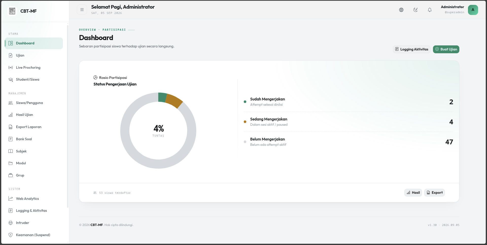
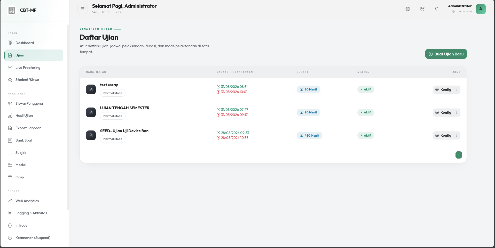
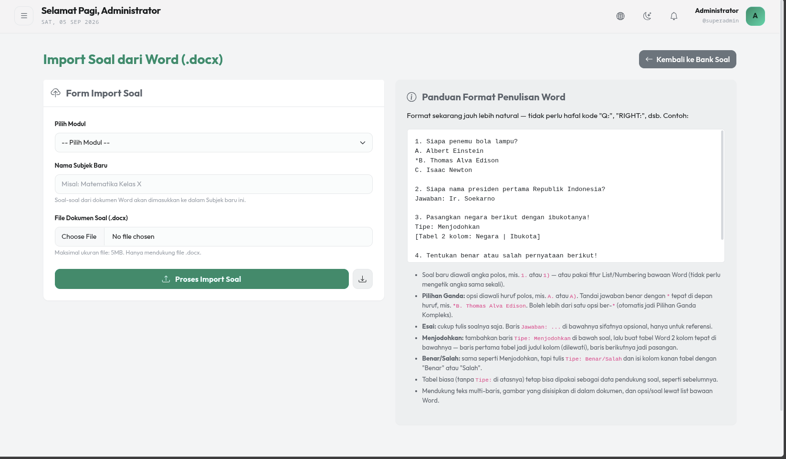
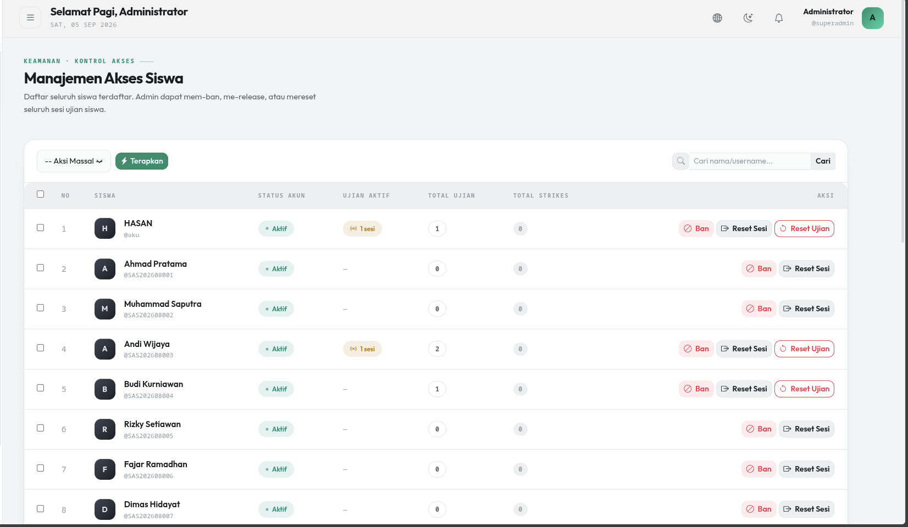
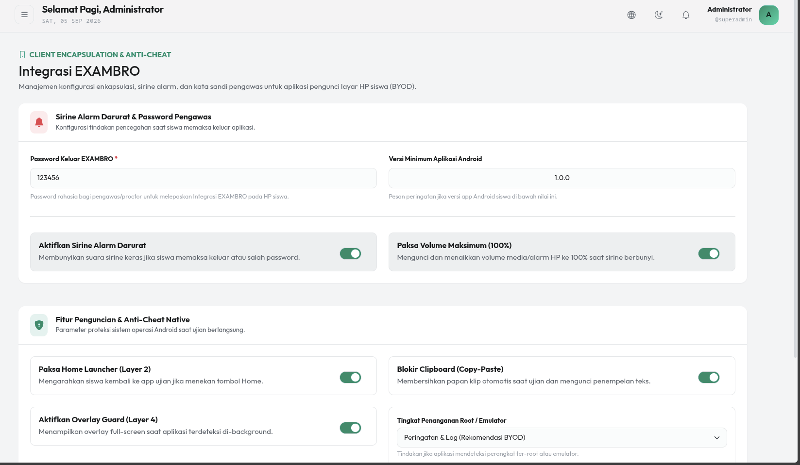
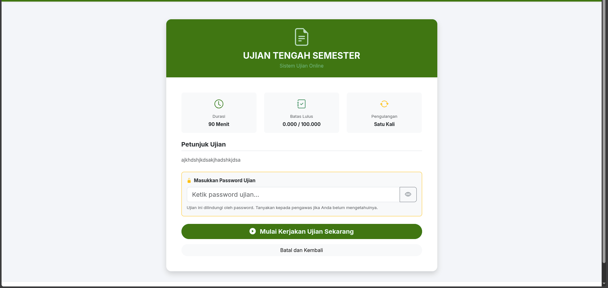
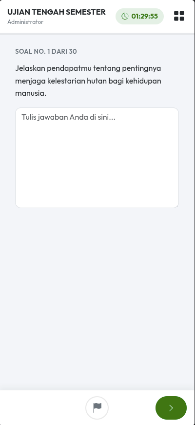
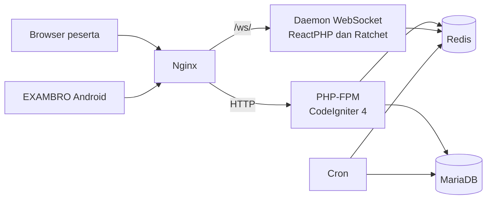

# CBT-MF


Aplikasi ujian berbasis komputer untuk sekolah dan madrasah, dibangun di atas
CodeIgniter 4 dan berjalan sepenuhnya di dalam Docker.

Komunikasi real-time ditangani daemon WebSocket terpisah, sehingga ratusan
peserta serentak tidak menghabiskan worker PHP-FPM. Halaman soal juga bisa
dibekukan menjadi berkas statis supaya tahan lonjakan akses di menit-menit
pertama ujian.



## Fitur utama

- **Bank soal enam tipe.** Pilihan ganda satu jawaban, pilihan ganda kompleks,
  esai atau teks singkat, menjodohkan, benar/salah, dan mengurutkan.
- **Import dari Word.** Soal ditulis di `.docx` dengan penomoran biasa, tanpa
  kode format khusus seperti `Q:` atau `RIGHT:`. Gambar yang tertanam di dokumen
  ikut terbawa.
- **Mode ujian statis.** Generator yang membekukan halaman soal menjadi HTML,
  sehingga tidak ada pekerjaan PHP per permintaan saat beban puncak.
- **Live proctoring.** Pengawas melihat peserta yang sedang mengerjakan, lalu
  bisa memberi tambahan waktu, mengeluarkan, atau memblokir sesi tanpa memuat
  ulang halaman.
- **EXAMBRO.** Aplikasi Android pengunci layar untuk skema BYOD, dengan sirine
  saat peserta memaksa keluar, overlay guard, blokir clipboard, pemaksaan home
  launcher, dan deteksi perangkat ter-root atau emulator.
- **Deteksi kecurangan di browser.** Peringatan otomatis saat peserta keluar
  dari fullscreen atau berpindah tab. Ambang pelanggarannya diatur administrator.
- **Antrean slot dan rem login.** Batas peserta serentak dengan halaman antrean,
  serta throttling login per-IP yang dirancang tidak menghukum sekolah di balik
  CGNAT.
- **Analisis butir soal.** Tingkat kesukaran, daya beda, dan rincian pengecoh
  per butir, dapat diekspor ke CSV.
- **Audit trail dan pelaporan.** Riwayat aktivitas dengan daftar pengguna online
  real-time, serta export laporan ke `.xls`.

## Tampilan

### Panel administrator

| | |
| --- | --- |
|  <br> Manajemen ujian: jadwal, durasi, dan mode pelaksanaan |  <br> Import soal dari `.docx` beserta panduan formatnya |
|  <br> Kontrol pengawas: ban, reset sesi, dan reset ujian |  <br> Konfigurasi penguncian layar perangkat Android |

### Sisi peserta

Halaman mulai ujian di desktop:



Pengerjaan soal di ponsel. Tata letak menyesuaikan layar kecil, sehingga skema
BYOD bisa berjalan tanpa aplikasi terpisah.



## Instalasi

### Prasyarat

- Docker dan Docker Compose V2
- Host Linux
- Akses root, karena installer mengatur kepemilikan direktori ke GID 33
  (`www-data`)

### Pemasangan

```bash
git clone https://github.com/rozendev/CBT-MF.git
cd CBT-MF
sudo bash scripts/cbt.sh install
```

Installer bersifat interaktif. Ia menanyakan nama database, username dan
password database, prefix nama container, token Cloudflare Tunnel (boleh
dikosongkan), base URL aplikasi, password Redis, serta username dan password
akun administrator pertama. Password admin adalah yang Anda ketik sendiri;
tidak ada kredensial bawaan.

Setelah pertanyaan selesai, installer menulis `.env` dan `src/.env`, membangun
dan menyalakan seluruh container, membetulkan permission direktori, menjalankan
`composer install`, menjalankan migrasi database, lalu membuat akun
administrator. Tidak ada langkah manual yang tersisa sesudahnya.

### Layanan yang berjalan

| Layanan | Alamat | Keterangan |
| --- | --- | --- |
| Aplikasi (Nginx) | `http://localhost:8080` | Satu-satunya port yang terekspos ke jaringan |
| WebSocket | `127.0.0.1:8060` | Terikat ke localhost, diproksi Nginx lewat `/ws/` |
| MariaDB | Internal | Hanya di dalam jaringan Docker |
| Redis | Internal | Hanya di dalam jaringan Docker |

Karena MariaDB dan Redis tidak dipublikasikan ke host, keduanya dibuka lewat
`scripts/cbt.sh db shell` dan `scripts/cbt.sh redis shell`.

## Penggunaan

`scripts/cbt.sh` adalah satu-satunya pintu operasional. Dijalankan tanpa
argumen, ia membuka menu interaktif:

```bash
sudo bash scripts/cbt.sh
```

Atau langsung sebagai subperintah:

```bash
sudo bash scripts/cbt.sh <grup> <perintah>
```

| Grup | Perintah |
| --- | --- |
| `docker` | `up`, `down`, `restart`, `logs`, `status` |
| `app` | `shell`, `php`, `composer` |
| `db` | `shell`, `root`, `export`, `import`, `reset-password` |
| `redis` | `shell`, `flush` |
| `bundle` | `build`, `status` |
| `data` | `images`, `optimize`, `cache-clear`, `finalize`, `prune-kiosk` |
| `migrate` | `up`, `status`, `rollback` |
| `tune` | `show`, `set` |

Perintah tingkat atas tanpa grup: `backup`, `log-rotate`, `reset-install`,
`test-k6`, `install`, `help`.

Perintah yang merusak data (`db import`, `redis flush`, `data optimize`,
`migrate rollback`, `reset-install`) menuntut Anda mengetik ulang nama
perintahnya sebelum dijalankan.

Yang sering dipakai sehari-hari:

```bash
sudo bash scripts/cbt.sh docker status      # periksa kondisi seluruh container
sudo bash scripts/cbt.sh docker logs        # ikuti log semua layanan
sudo bash scripts/cbt.sh backup             # backup database dan Redis
sudo bash scripts/cbt.sh db reset-password  # setel ulang password admin
sudo bash scripts/cbt.sh data finalize      # tutup attempt yang lewat batas waktu
```

Setelah mengubah UI ujian, bundle kiosk wajib dibangun ulang. Langkah ini mudah
terlewat:

```bash
sudo bash scripts/cbt.sh bundle build
```

Tanpa langkah itu, perangkat yang memakai EXAMBRO tetap menerima artefak lama,
dan sistem tidak memunculkan pesan galat apa pun yang memberi tahu Anda. Gunakan
`bundle status` untuk membandingkan versi bundle lokal, server, dan zip publik.

## Arsitektur



Alasan bentuk di atas:

**Daemon WebSocket terpisah.** Komunikasi server-ke-klien tidak lewat PHP-FPM.
Daemon single-thread berbasis ReactPHP mendengarkan Redis Pub/Sub dan menyiarkan
perintah pengawas ke peserta. Satu proses kecil menggantikan ratusan worker yang
tertahan, sehingga jumlah peserta serentak tidak lagi dibatasi jumlah worker.
Konsekuensinya, tidak boleh ada operasi sinkronus yang memblokir event loop di
dalam daemon, termasuk koneksi PDO ke MariaDB.

**Autosave ke Redis, flush ke MariaDB.** Aplikasi menulis jawaban peserta ke
Redis selama ujian berlangsung, lalu memindahkannya ke MariaDB secara massal di
akhir. Ujian karenanya tidak menghasilkan satu penulisan database per jawaban.

**Mode ujian statis.** Halaman soal dibekukan menjadi HTML, sehingga
pembacaannya tidak memerlukan pekerjaan PHP maupun kueri database per
permintaan.

Tujuh service di `docker-compose.yml`:

| Service | Peran |
| --- | --- |
| `nginx` | Reverse proxy dan penyaji berkas statis |
| `php` | PHP-FPM menjalankan aplikasi CodeIgniter 4 |
| `websocket` | Daemon `spark websocket:serve` |
| `cron` | Menutup attempt kedaluwarsa, probe dependensi, membersihkan kunci kiosk basi |
| `cloudflared` | Cloudflare Tunnel, aktif bila `CF_TUNNEL_TOKEN` diisi |
| `mariadb` | Basis data |
| `redis` | Sesi, cache, autosave, dan Pub/Sub |

## Struktur repositori

| Direktori | Isi |
| --- | --- |
| `src/` | Aplikasi CodeIgniter 4 |
| `docker/` | Dockerfile dan konfigurasi Nginx, PHP-FPM, MariaDB |
| `scripts/` | `cbt.sh` dan utilitas pendukung |
| `cbt-kiosk-app/` | Sumber aplikasi Android EXAMBRO |
| `docs/` | Panduan Cloudflare, Nginx, dan rancangan fitur |
| `docker-compose.yml` | Orkestrasi container |
| `Dockerfile.railway`, `railway.json`, `docker/railway/` | Berkas pendukung deploy ke Railway |

Selain pemasangan Docker di atas, tersedia jalur deploy ke Railway untuk
lingkungan uji yang bisa diakses dari mana saja tanpa menyiapkan VPS.
Panduannya di [RAILWAY.md](RAILWAY.md).

## Keamanan produksi

Repositori ini publik, jadi apa pun yang tertulis di dalamnya diketahui semua
orang. Tidak ada satu pun rahasia bawaan yang bisa dipakai; semuanya harus Anda
isi sendiri.

**`INTRUDER_TOKEN` sudah diurus installer.** `scripts/cbt.sh install`
membangkitkan token acak, menulisnya ke `src/.env`, lalu menyulihkannya ke
halaman honeypot `403.html` dan `404.html`. Nilainya dipertahankan kalau
installer dijalankan ulang.

Yang perlu Anda kerjakan sendiri hanya kalau memasang secara manual tanpa
installer. Selama token kosong, endpoint laporan penyusup menolak semua
permintaan dengan status 503 dan kedua halaman honeypot tidak mencatat apa pun.

```bash
openssl rand -hex 32
```

Isikan hasilnya ke `INTRUDER_TOKEN` di `src/.env`, bukan di `.env` akar.
Docker Compose hanya menyuntikkan `DB_*` dan `REDIS_*` ke container php, jadi
token yang ditulis di `.env` akar tidak akan terbaca aplikasi. Lalu ganti nilai
`TOKEN` di `docker/nginx/html/errors/403.html` dan
`docker/nginx/html/errors/404.html` dengan token yang sama, karena sisi klien
dan sisi server harus memakai nilai yang identik.

**Isi `DB_PASSWORD` dan `MYSQL_ROOT_PASSWORD`.** Berkas `.env.example` sengaja
memuat penanda `GANTI_...`, bukan sandi yang bisa dipakai. Bila Anda memasang
lewat `scripts/cbt.sh install`, keduanya sudah ditanyakan saat instalasi.

**Isi `KIOSK_APP_SECRET`.** Ini opsional, tetapi tanpanya endpoint verifikasi
keluar kiosk hanya dilindungi rate-limit per-IP.

**Setel `CI_ENVIRONMENT = production` di `src/.env`.** Nilai ini menonaktifkan
tampilan galat yang membocorkan jalur berkas dan kueri.

**Batasi port 8080.** Bila Anda memakai Cloudflare Tunnel atau reverse proxy
terpisah, ubah pemetaan port Nginx di `docker-compose.yml` menjadi
`127.0.0.1:8080:80`, supaya aplikasi tidak dapat dijangkau langsung dari
internet.

## Pemecahan masalah

Kasus yang paling sering menimpa pemasangan baru. Selebihnya ada di
[Troubleshooting.md](Troubleshooting.md).

### WebSocket tidak terhubung

Gejala: peringatan "Reconnecting WebSocket..." muncul terus menerus di halaman
ujian.

1. Periksa container WebSocket berjalan: `sudo bash scripts/cbt.sh docker status`.
2. Bila statusnya *restarting* atau *exited*, baca lognya:
   `sudo bash scripts/cbt.sh docker logs`.
3. Muat ulang konfigurasi proxy: `sudo bash scripts/cbt.sh docker restart`.
4. Bila hanya terjadi pada halaman mode statis, hapus halaman statis itu dari
   menu admin lalu buat ulang. Halaman lama mungkin tidak membawa parameter
   `user_id` pada URL WebSocket-nya.

### Gagal generate halaman statis atau upload gambar

Gejala: pesan tidak dapat menulis berkas HTML, atau
`Could not move file "..." to "/var/www/html/public/uploads/"`.

Direktori `src/writable/`, `src/public/static/`, dan `src/public/uploads/` harus
dapat ditulis oleh PHP-FPM. Jangan memakai `chmod 777`. Atur kepemilikan ke grup
web server, lalu beri izin `775`.

```bash
mkdir -p src/writable src/public/static src/public/uploads
sudo chown -R :33 src/writable src/public/static src/public/uploads
sudo chmod -R 775 src/writable src/public/static src/public/uploads
```

### Migrasi gagal dengan "Access denied for user"

Gejala: `Unable to connect to the database ... Access denied for user`, padahal
password yang dimasukkan sudah benar.

MariaDB hanya menetapkan username dan password satu kali, yaitu saat volume
dibuat pertama kali. Bila Anda pernah memasang dengan kredensial lama, volume
lama tetap dipakai. Volume itu harus dihapus agar MariaDB terinisialisasi ulang.

Perintah berikut menghapus seluruh data di database.

```bash
docker compose down -v
sudo bash scripts/cbt.sh install
```

## Berkontribusi

Laporan bug dan usulan fitur dibuka lewat
[GitHub Issues](https://github.com/rozendev/CBT-MF/issues).

Untuk perubahan kode, buat branch dari `main` dan ajukan pull request. Jalankan
pengujian di dalam container PHP:

```bash
sudo bash scripts/cbt.sh app shell
composer test
```

Suite Throttling memakai bootstrap terpisah karena membutuhkan framework yang
dimuat penuh, dan sengaja tidak dimasukkan ke `composer test`. Jalankan
terpisah:

```bash
vendor/bin/phpunit -c phpunit.throttling.xml.dist
```

Bila perubahan Anda menyentuh UI ujian, jalankan `scripts/cbt.sh bundle build`
dan sertakan hasilnya, karena perangkat kiosk memuat bundle itu, bukan berkas
sumbernya.

## Dukungan

Pertanyaan dan laporan masalah lewat
[GitHub Issues](https://github.com/rozendev/CBT-MF/issues). Sertakan keluaran
`scripts/cbt.sh docker status` dan potongan log yang relevan, karena keduanya
mempersingkat penelusuran.

## Status proyek

Aktif dikembangkan. Versi aplikasi saat ini 1.30.

## Lisensi

Perangkat lunak ini dilisensikan di bawah GNU Affero General Public License v3.0
atau versi setelahnya (AGPL-3.0-or-later). Teks lengkapnya ada di berkas
[`LICENSE`](LICENSE).

Yang perlu diketahui sebelum memakainya:

- Anda bebas memakai, mempelajari, mengubah, dan menyebarkan aplikasi ini.
- Setiap turunan yang Anda sebarkan harus memakai lisensi yang sama.
- Pasal 13 AGPL adalah yang membedakannya dari GPL biasa. Jika Anda mengubah
  aplikasi ini lalu menjalankannya sebagai layanan yang diakses lewat jaringan,
  Anda wajib menawarkan kode sumber versi Anda kepada para penggunanya,
  meskipun Anda tidak pernah membagikan berkasnya. Karena CBT ini memang dipakai
  lewat jaringan, pasal itu berlaku pada pemakaian yang paling lazim.

Menjalankan aplikasi ini apa adanya untuk ujian di sekolah Anda tidak
mewajibkan apa pun. Kewajiban pasal 13 baru muncul kalau Anda mengubah kodenya
dan menyajikan hasil ubahannya kepada pengguna lain lewat jaringan.

Ringkasan ini ditulis untuk memudahkan, bukan sebagai nasihat hukum. Yang
mengikat adalah teks di `LICENSE`.

### Lisensi dependensi

Seluruh dependensi Composer berlisensi permisif dan sejalan dengan AGPL-3.0:
34 paket MIT, 27 paket BSD-3-Clause, dan satu paket LGPL-3.0-only
(`phpoffice/phpword`). Daftar terkini bisa dilihat dengan:

```bash
sudo bash scripts/cbt.sh app composer licenses
```
