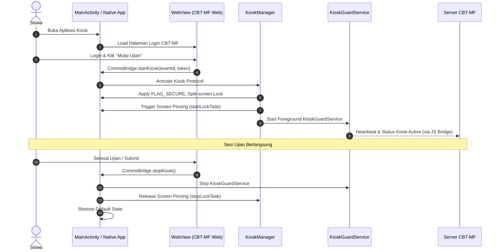
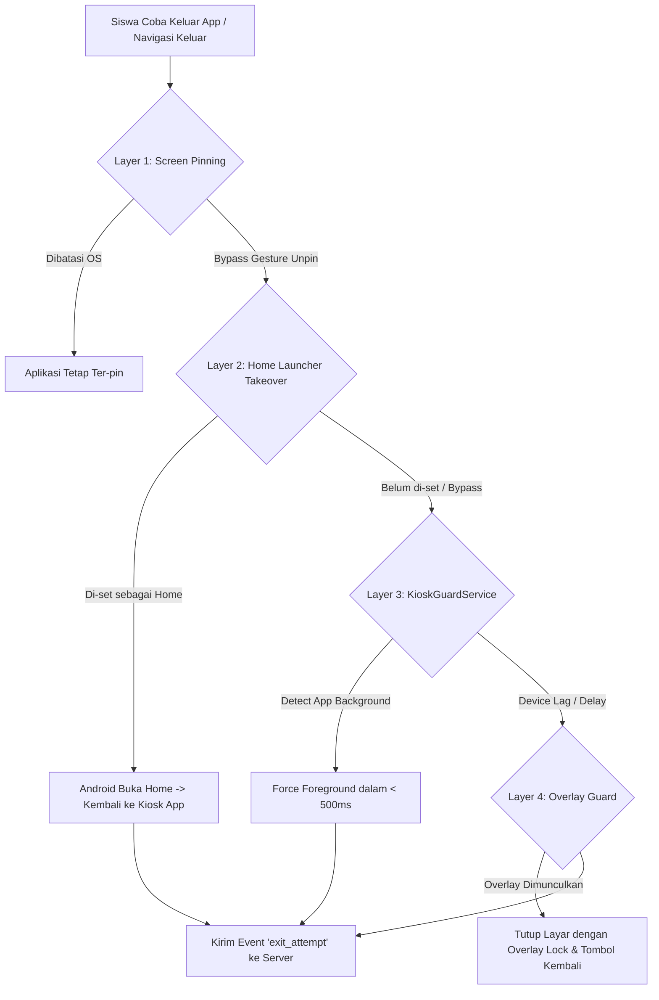
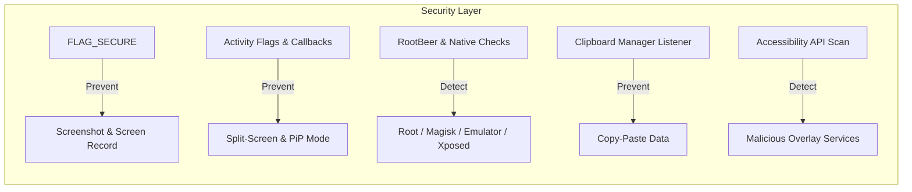
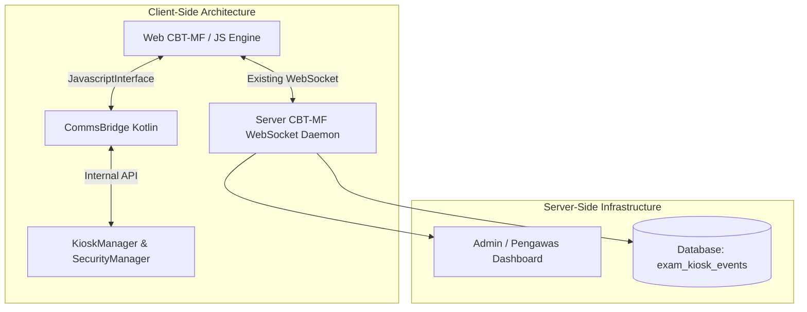

# Android Kiosk WebView Wrapper untuk CBT-MF

## 1. Overview & Goals

### 1.1 Deskripsi Singkat
Dokumen ini mendesain aplikasi Android Native (Kotlin) yang bertindak sebagai *WebView Wrapper* khusus untuk sistem Computer-Based Testing (CBT-MF). Aplikasi ini mengisolasi perangkat siswa ke dalam kondisi *Kiosk Mode* selama sesi ujian berlangsung.

### 1.2 Latar Belakang & Rasionalitas Pendekatan
Pada lingkungan Bring Your Own Device (BYOD), perangkat yang digunakan adalah smartphone milik pribadi siswa. *True Lock Task Mode* (Kiosk sejati pada level Android OS) membutuhkan hak akses **Device Owner**, yang hanya dapat dipasang melalui *provisioning* saat *factory reset* (wipe data perangkat) atau melalui solusi Enterprise Mobility Management (EMM/MDM). Prosedur ini tidak akseptabel untuk perangkat pribadi siswa.

Oleh karena itu, aplikasi ini menerapkan pendekatan **Hybrid Screen Pinning + Multi-Layer Defense**. Pendekatan ini mengombinasikan fitur bawaan OS (Screen Pinning / Un-managed Lock Task Mode) dengan pertahanan berlapik (Home Launcher Takeover, Foreground Guard Service, dan Overlay Guard) untuk meminimalkan potensi kecurangan tanpa harus merusak atau mengontrol penuh OS perangkat siswa.

### 1.3 Sasaran (Goals)
1. **Efektivitas Kiosk (95%+ Target Preventif):** Memastikan 95%+ siswa tidak dapat mengelak, meminimalkan kecurangan standar seperti berpindah ke browser lain, melihat catatan, membuka aplikasi percakapan, atau mengambil tangkapan layar.
2. **Kesesuaian BYOD:** Dapat diinstal langsung via APK/Play Store pada Android 9+ (API Level 28 ke atas) tanpa *factory reset* atau hak *root/Device Owner*.
3. **Deteksi Real-time & Pelaporan:** Setiap percobaan keluar dari kiosk atau kejanggalan lingkungan perangkat (rooting, instrumen tampering) dilaporkan secara *real-time* ke server CBT-MF.
4. **Resiliensi:** Bertahan dari gangguan koneksi, interupsi panggilan telepon, crash tak terduga, dan *reboot* perangkat.

---

## 2. Arsitektur Sistem

### 2.1 Komponen Utama Aplikasi Native
Aplikasi terdiri dari 6 komponen inti yang terintegrasi secara modular:

1. **`MainActivity`**
   - Single-Activity Architecture yang bertindak sebagai host utama bagi `WebView`.
   - Mengontrol siklus hidup aplikasi (*lifecycle management*) dan menjadi *entry point* pengguna.
   - Mendaftarkan diri di `AndroidManifest.xml` sebagai alternatif Home Launcher (`CATEGORY_HOME`).
2. **`WebView`**
   - Komponen visual yang memuat web app CBT-MF.
   - Mengaktifkan eksekusi JavaScript, DOM Storage, dan komunikasi dua arah ke native via `JavascriptInterface`.
3. **`KioskManager`**
   - Mengelola status Kiosk Mode.
   - Menangani pengaktifan dan penonaktifan Screen Pinning (`Activity.startLockTask()` / `stopLockTask()`).
   - Berkoordinasi dengan `OverlayGuard` dan `KioskGuardService`.
4. **`SecurityManager`**
   - Mengatur perlindungan keamanan aktif dan pasif pada perangkat.
   - Terdiri dari sub-modul: `RootDetector`, `EmulatorDetector`, dan `AccessibilityScanner`.
   - Mengaktifkan `WindowManager.LayoutParams.FLAG_SECURE` untuk memblokir tangkapan layar dan rekaman layar.
   - Mengamankan clipboard dan mematikan menu konteks bawaan (long-press).
5. **`CommsBridge`**
   - Mengimplementasikan `JavascriptInterface` sebagai jembatan interaksi antara JavaScript web CBT-MF dan kode Native Kotlin.
   - Menerima arahan dari server (via JS) untuk memulai atau menghentikan Kiosk Mode.
6. **`KioskGuardService`**
   - *Foreground Service* dengan *persistent notification* yang berjalan independen selama sesi ujian.
   - Memantau kejelasan status aplikasi di layar utama (*foreground presence*) dan melakukan *force-bring-to-front* jika aplikasi kehilangan fokus.

### 2.2 Alur Kerja Utama (Main Execution Flow)



---

## 3. Kiosk Lock Layer (Defense-in-Depth)

Arsitektur Kiosk mengadopsi prinsip *Defense-in-Depth* dengan 4 lapisan pertahanan bertingkat untuk mengantisipasi bypass pada Android BYOD:



### 3.1 rincian Lapisan Pertahanan

#### Layer 1: Screen Pinning (`startLockTask()`)
- Memanfaatkan API standar Android `activity.startLockTask()`.
- **Karakteristik pada BYOD (Tanpa Device Owner):** Sistem Android akan menampilkan dialog konfirmasi kepada pengguna untuk menyetujui penatanan layar (*pinning*).
- **Efek:** Bar navigasi (*Back, Home, Recent Apps*) disembunyikan/dibatasi. Panel notifikasi (*status bar*) tidak dapat ditarik turun.
- **Kelemahan & Keamanan:** Pada perangkat BYOD, pengguna dapat melepaskan *pinning* dengan menekan kombinasi tombol gestur bawaan OS (misal: tekan dan tahan *Back + Home*). Oleh karena itu, Layer 2, 3, dan 4 diperlukan.

#### Layer 2: Home Launcher Takeover
- Aplikasi mendaftarkan `intent-filter` berikut di `AndroidManifest.xml`:
  ```xml
  <intent-filter>
      <action android:name="android.intent.action.MAIN" />
      <category android:name="android.intent.category.HOME" />
      <category android:name="android.intent.category.DEFAULT" />
  </intent-filter>
  ```
- Saat Kiosk diaktifkan, aplikasi mengecek apakah aplikasi sudah menjadi Default Launcher. Jika belum, dialog sistem dipanggil untuk mengarahkan pengguna memilih Kiosk App sebagai Home Launcher sementara.
- **Efek:** Jika siswa berhasil melepas Screen Pinning (Layer 1) dan menekan tombol Home, sistem Android tidak akan membuka Launcher bawaan ponsel, melainkan secara otomatis membuka kembali Kiosk App.
- **Pelepasan:** Saat ujian selesai (`stopKiosk()`), aplikasi menampilkan panduan prompt untuk mengembalikan Home Launcher bawaan siswa.

#### Layer 3: Foreground Guard Service (`KioskGuardService`)
- Berjalan sebagai `Foreground Service` yang terikat dengan notifikasi *persistent* berprioritas tinggi (`IMPORTANCE_LOW` atau `DEFAULT` sesuai regulasi background service).
- Mengimplementasikan `Application.ActivityLifecycleCallbacks` untuk mendeteksi kapan `MainActivity` berpindah ke status `onPause()` atau `onStop()`.
- Memanfaatkan `UsageStatsManager` (jika izin diberikan) untuk memantau package yang berada di *foreground*.
- Jika terdeteksi aplikasi lain mengambil *foreground*, `KioskGuardService` mengeksekusi `Intent` untuk memanggil `MainActivity` kembali ke layar dalam waktu kurang dari **500 ms**.
- Mengirim sinyal peringatan `exit_attempt` ke server CBT-MF.

#### Layer 4: Overlay Guard (Fallback Penutup)
- Memanfaatkan izin `SYSTEM_ALERT_WINDOW` (`TYPE_APPLICATION_OVERLAY`).
- Dipasang jika pertahanan Layer 1–3 mengalami penundaan eksekusi oleh OS (misal: akibat sistem penghemat memori/RAM bawaan vendor).
- Apabila `MainActivity` berada di *background* lebih dari 1000 ms, `OverlayGuard` akan merender tampilan penuh (*full-screen view*) yang menutupi seluruh layar.
- Overlay berisi pesan teguran: *"Aplikasi Ujian Terinterupsi. Klik untuk Kembali ke Soal"* dan tombol tunggal yang memaksa *focusing* kembali ke `MainActivity`.

### 3.2 Batasan Teknis Terbuka (BYOD Limitations)
Mengingat aplikasi berjalan pada perangkat siswa tanpa akses *Device Owner/Firmware-level Control*, terdapat kondisi ekstrem yang **TIDAK BISA DIBLOKIR SECARA LOKAL** oleh aplikasi native:
1. **Perangkat Dimatikan / Force Reboot:** Siswa menekan dan menahan tombol Power fisik untuk melakukan restart.
2. **Force Stop via ADB:** Perangkat dihubungkan ke komputer dengan USB Debugging aktif dan diperintah `adb shell am force-stop`.
3. **Boot ke Safe Mode:** Perangkat di-reboot ke mode aman sehingga service pihak ketiga dimatikan oleh OS.

**Mekanisme Mitigasi:** Ketiga tindakan di atas dipantau pada **Server-Side**. Apabila koneksi WebSocket terputus (*heartbeat timeout*), server CBT-MF mencatat kejadian tersebut sebagai potensi kecurangan/interupsi paksa dan memblokir sesi ujian siswa hingga di-unblock oleh pengawas/admin.

---

## 4. Security Layer



### 4.1 Block Screenshot & Screen Recording
- **Implementasi:**
  ```kotlin
  window.setFlags(
      WindowManager.LayoutParams.FLAG_SECURE,
      WindowManager.LayoutParams.FLAG_SECURE
  )
  ```
- **Hasil:** Tangkapan layar (*screenshot*) menghasilkan gambar hitam pekat. Perekaman layar (*screen recording*) atau *screen mirroring* (via HDMI/Chromecast) hanya menampilkan tampilan kosong/hitam.
- **Reliabilitas:** **Sangat Tinggi** (Fitur resmi framework Android Security).

### 4.2 Block Split-Screen & Picture-in-Picture (PiP)
- **Implementasi Manifest:**
  ```xml
  <activity
      android:name=".MainActivity"
      android:resizeableActivity="false"
      android:supportsPictureInPicture="false"
      android:configChanges="orientation|screenSize|keyboardHidden">
  </activity>
  ```
- **Runtime Guard:**
  Dalam `onMultiWindowModeChanged` dan `onResume()`, aplikasi secara aktif mengecek:
  ```kotlin
  if (isInMultiWindowMode || isInPictureInPictureMode) {
      // Peringatkan dan paksa keluar dari mode multi-window
      SecurityManager.handleSecurityViolation("SPLIT_SCREEN_DETECTED")
  }
  ```
- **Reliabilitas:** **Sangat Tinggi** pada Android 9+.

### 4.3 Root, Emulator, & Tampering Detection
- **Teknologi:** Integrasi library `RootBeer` yang diperluas dengan pemeriksaan kustom:
  - **Root Detection:** Pemeriksaan eksistensi `su` binary pada path sistem, artifacts Magisk (`/sbin/.magisk`, `/data/adb/magisk`), status SELinux (`Permissive`), serta properti *build* berbahaya (`ro.debuggable=1`, `ro.secure=0`).
  - **Emulator Detection:** Evaluasi `Build.FINGERPRINT`, `Build.MODEL`, `Build.HARDWARE` (misal: *goldfish, ranchu, sdk_gphone*), ketidakadaan sensor fisik hardware, dan ketidaktersediaan arsitektur ARM murni.
  - **Framework Hooking Detection:** Pemindaian artifacts Frida (misal: port 27042), Xposed Framework, serta inspeksi *stack trace* untuk menemukan metode penggubahan runtime (*dynamic hooking*).
- **Kebijakan Tindakan (Behavioral Policy):**
  Deteksi **TIDAK MELAKUKAN HARD-BLOCK KETAT** (aplikasi tidak langsung ditutup secara sepihak) untuk mencegah *false positive* pada beberapa ROM bawaan pabrikan yang belum terverifikasi (misal: custom Android OS bawaan vendor). Sebaliknya, status kejanggalan dikirim sebagai `security_alert` ke server CBT-MF agar Pengawas/Admin dapat menentukan tindakan (*flagging* ujian).

### 4.4 Clipboard Guard
- **Penanganan:**
  - Saat Kiosk diaktifkan, clipboard sistem langsung dibersihkan:
    ```kotlin
    val clipboard = getSystemService(Context.CLIPBOARD_SERVICE) as ClipboardManager
    clipboard.setPrimaryClip(ClipData.newPlainText("", ""))
    ```
  - Mendaftarkan `OnPrimaryClipChangedListener`. Setiap ada perubahan data clipboard selama kiosk berlangsung, isi clipboard akan langsung dihapus kembali secara instant.
  - Mengonfigurasi `WebView` untuk mematikan fitur seleksi teks berlebih dan menonaktifkan *Long-press Context Menu* via JavaScript & CSS (`user-select: none`).

### 4.5 Accessibility Service Scan
- **Tujuan:** Mendeteksi aplikasi pihak ketiga yang menggunakan *Accessibility Service* secara tidak wajar untuk membaca isi layar atau mensimulasikan tap secara otomatis (*auto-clicker/bot*).
- **Mekanisme:**
  - Menggunakan `AccessibilityManager.getEnabledAccessibilityServiceList()`.
  - Membandingkan daftar aplikasi terpasang dengan *whitelist* layanan resmi (seperti Google TalkBack, Switch Access).
  - Layanan yang tidak dikenal atau mencurigakan dilaporkan ke server CBT-MF via `security_alert`.

### 4.6 Matriks Reliabilitas Keamanan

| Fitur Keamanan | Reliabilitas | Dapat Di-bypass? | Catatan / Kondisi Bypass |
|---|---|---|---|
| **Block Screenshot / Record** | ★★★★★ (Sangat Tinggi) | Tidak | Kecuali perangkat di-root & menggunakan modul Xposed khusus bypass FLAG_SECURE. |
| **Block Split-Screen** | ★★★★★ (Sangat Tinggi) | Tidak | Terjamin penuh pada Android 9+ melalui deklarasi Manifest & Runtime check. |
| **Root & Tampering Detection** | ★★★★☆ (Tinggi) | Ya | Dapat disamarkan menggunakan Magisk Hide / DenyList canggih (Dibutuhkan effort tinggi). |
| **Clipboard Guard** | ★★★★☆ (Tinggi) | Sulit | Sangat efektif mencegah aksi Copy-Paste soal/jawaban antar aplikasi. |
| **Accessibility Scan** | ★★★☆☆ (Sedang) | Ya | Pengguna dapat menyalakan service berbahaya *setelah* pemindaian awal selesai. Ditanggulangi dengan periodic rescan. |

---

## 5. Communication Bridge (WebView ↔ Native ↔ Server)



### 5.1 JS → Native Interface (`CommsBridge.kt`)
Menggunakan annotation `@JavascriptInterface` pada class `CommsBridge`.

Method yang disediakan untuk dipanggil dari JavaScript Web CBT-MF:

```kotlin
class CommsBridge(private val activity: MainActivity) {

    @JavascriptInterface
    fun startKiosk(examId: String, token: String): Boolean {
        return activity.kioskManager.startKiosk(examId, token)
    }

    @JavascriptInterface
    fun stopKiosk(): Boolean {
        return activity.kioskManager.stopKiosk()
    }

    @JavascriptInterface
    fun getDeviceInfo(): String {
        // Mengembalikan JSON string berisi spesifikasi device, OS version, app version, status root
        return SecurityManager.getDeviceInfoJson(activity)
    }

    @JavascriptInterface
    fun getKioskStatus(): String {
        // Mengembalikan JSON string status kiosk (active, layers status, errors)
        return activity.kioskManager.getStatusJson()
    }
}
```

### 5.2 Native → JS Communication
Komunikasi dari Native Kotlin menuju WebView dilakukan menggunakan `WebView.evaluateJavascript()`. Native mengirimkan pesan berformat JSON yang mentrigger `CustomEvent` di window browser.

Sintaks panggilan Native:
```kotlin
fun sendEventToJS(webView: WebView, eventName: String, dataJson: String) {
    val script = """
        window.dispatchEvent(new CustomEvent('$eventName', { detail: $dataJson }));
    """.trimIndent()
    webView.post { webView.evaluateJavascript(script, null) }
}
```

Daftar Event Native → JS:
- `kiosk_started`: Sinyal bahwa Kiosk Mode dan seluruh layer pertahanan berhasil diaktifkan.
- `kiosk_failed`: Sinyal bahwa pengaktifan Kiosk Mode gagal (misal: pengguna menolak izin).
- `exit_attempt`: Sinyal bahwa pengguna mencoba keluar dari aplikasi (Home/Recent pressed).
- `security_alert`: Sinyal ditemukannya potensi pelanggaran (Root, Accessibility mencurigakan, Split Screen).

### 5.3 Native → Server Communication (Routing via Existing Web Channel)
- **Desain Efisien:** Aplikasi Native **TIDAK** membuat koneksi Socket/HTTP terpisah secara langsung ke server untuk mengirimkan event kiosk.
- **Mekanisme:** Native mengirimkan event ke JS (via `evaluateJavascript`), lalu JS di halaman CBT-MF yang memforward event tersebut menggunakan koneksi **WebSocket** yang sudah ada (*existing WebSocket channel*).
- **Keuntungan:** Menghemat konsumsi daya dan kuota internet, mencegah duplikasi session management, serta menyederhanakan arsitektur autentikasi.

### 5.4 Perubahan Terkait pada Sistem CBT-MF (Server-Side Integration)

Perubahan ini diperlukan pada server CBT-MF agar fitur Kiosk bekerja secara menyeluruh:

1. **JavaScript Sisi Klien (Frontend Web Ujian):**
   - Menambahkan event listener pada `window` untuk menangkap `kiosk_started`, `exit_attempt`, dan `security_alert`.
   - Mengirim payload JSON event ke WebSocket Server CBT-MF.
2. **WebSocket Daemon (Backend Server):**
   - Menambahkan pesan penanganan baru: `kiosk_status`, `exit_attempt`, dan `security_alert`.
   - Menyimpan log event ke dalam basis data.
3. **Database Schema Baru (`exam_kiosk_events`):**
   ```sql
   CREATE TABLE exam_kiosk_events (
       id BIGINT AUTO_INCREMENT PRIMARY KEY,
       exam_session_id INT NOT NULL,
       student_id INT NOT NULL,
       event_type VARCHAR(50) NOT NULL, -- exit_attempt, security_alert, status_change
       event_details JSON NULL,
       created_at TIMESTAMP DEFAULT CURRENT_TIMESTAMP,
       FOREIGN KEY (student_id) REFERENCES students(id)
   );
   ```
4. **Dashboard Admin / Pengawas:**
   - Menambahkan indikator status visual pada daftar siswa yang sedang ujian:
     - 🔒 **Kiosk Active** (Hijau): Kiosk berjalan normal tanpa interupsi.
     - ⚠️ **Kiosk Warning** (Kuning): Terdeteksi percetakan keluar / warning root.
     - 🔓 **Kiosk Inactive / Un-pinned** (Merah): Siswa tidak berada dalam aplikasi / koneksi terputus.

---

## 6. Konfigurasi & Dinamika URL

### 6.1 Initial Setup Flow
1. **First-Run Screen:** Saat aplikasi dibuka pertama kali, ditampilkan form sederhana untuk memasukkan **Kode Sekolah** atau **URL Server CBT-MF**.
2. **Fetch Server Configuration:**
   Aplikasi melakukan request ke endpoint konfirmasi: `GET {SERVER_URL}/api/kiosk/config`.
   Example Response JSON:
   ```json
   {
     "school_name": "SMA Negeri 1 CBT",
     "exam_url": "https://cbt.sekolah.sch.id/exam/login",
     "min_app_version": "1.2.0",
     "features": {
       "enforce_home_launcher": true,
       "block_clipboard": true,
       "root_detection_strictness": "warning",
       "overlay_guard_enabled": true
     }
   }
   ```
3. **Persistence:** Konfigurasi ini disimpan ke dalam `EncryptedSharedPreferences`. Untuk membuka halaman ujian selanjutnya, aplikasi dapat langsung mengarahkan ke `exam_url`.
4. **Dynamic Toggle:** Admin sekolah dapat mengatur sakelar fitur keamanan (*feature flags*) dari Dashboard Web CBT-MF per sesi ujian.

---

## 7. Penanganan Case Khusus (Edge Cases Handling)

| Skenario Edge Case | Potensi Dampak | Penanganan & Strategi Pemulihan (*Recovery Mechanism*) |
|---|---|---|
| **Siswa menolak Screen Pinning** | Kiosk Layer 1 tidak aktif. | WebView menampilkan modal dialog instruksi ulang. Akses ke lembar soal **dikonfirmasi terkunci** oleh JavaScript hingga `kiosk_started` ter-trigger. |
| **Siswa menolak Home Launcher** | Pertahanan Layer 2 tidak aktif. | Aplikasi melanjutkan kiosk dalam status *Partial Kiosk*. Mengirim sinyal `partial_kiosk_warning` ke server untuk dicatat pengawas. |
| **Jaringan Internet Putus** | Komunikasi ke server terhenti. | Aplikasi menampilkan *halaman offline bawaan native*. Kiosk Mode **tetap aktif terkunci** secara lokal. Saat internet kembali terhubung, WebSocket otomatis mere-koneksi. |
| **Ponsel Restart / Low Battery Off** | Sesi terputus total. | Server mencatat status *Disconnection*. Saat ponsel menyala kembali dan app dibuka, `SharedPreferences` membaca status ujian belum `stopKiosk()`, lalu secara otomatis memasukkan kembali siswa ke Kiosk Mode (*Auto-resume*). |
| **Panggilan Telepon Masuk** | Layar terdistraksi oleh UI Telepon. | `KioskGuardService` mendeteksi perubahan fokus. `OverlayGuard` menutup UI panggilan telepon jika siswa tidak segera kembali ke aplikasi. Kejadian dicatat sebagai event `phone_interruption`. |
| **Aplikasi Crash / Force Close** | Terlempar ke OS Desktop. | Mendaftarkan `UncaughtExceptionHandler`. Sebelum mati, aplikasi mengirimkan signal restart ke `AlarmManager` untuk membuka kembali `MainActivity` dalam 1 detik (*Auto-restart & Resume Kiosk*). |
| **Low Battery Alert OS (< 15%)** | Pop-up OS muncul di layar. | `KioskGuardService` membiarkan pop-up sistem baterai lewat, namun terus memantau fokus. Jika siswa menggunakan pop-up untuk melompat ke Settings, Guard langsung menarik fokus kembali ke App. |

---

## 8. Struktur Direktori Project Android (Kotlin)

```
cbt-kiosk-app/
├── build.gradle.kts (Project level)
├── settings.gradle.kts
├── app/
│   ├── build.gradle.kts (App level Dependencies & Config)
│   └── src/
│       └── main/
│           ├── java/
│           │   └── id/
│           │       └── sch/
│           │           └── cbt/
│           │               └── kiosk/
│           │                   ├── MainActivity.kt
│           │                   ├── MainApplication.kt
│           │                   ├── kiosk/
│           │                   │   ├── KioskManager.kt
│           │                   │   ├── KioskGuardService.kt
│           │                   │   └── OverlayGuard.kt
│           │                   ├── security/
│           │                   │   ├── SecurityManager.kt
│           │                   │   ├── RootDetector.kt
│           │                   │   ├── EmulatorDetector.kt
│           │                   │   └── AccessibilityScanner.kt
│           │                   ├── bridge/
│           │                   │   └── CommsBridge.kt
│           │                   ├── config/
│           │                   │   └── AppConfig.kt
│           │                   └── utils/
│           │                       ├── Logger.kt
│           │                       └── NetworkUtils.kt
│           ├── res/
│           │   ├── layout/
│           │   │   ├── activity_main.xml
│           │   │   ├── layout_overlay_guard.xml
│           │   │   └── activity_config.xml
│           │   ├── values/
│           │   │   ├── colors.xml
│           │   │   ├── strings.xml
│           │   │   └── styles.xml
│           │   └── xml/
│           │       └── network_security_config.xml
│           └── AndroidManifest.xml
```

---

## 9. Rencana Pengujian (Testing Strategy)

### 9.1 Unit Testing
- Memuji logika `KioskManager` (evaluasi state transition: `IDLE` -> `LOCKING` -> `LOCKED` -> `UNLOCKING`).
- Memuji parsing data pada `CommsBridge` dan pengolahan skema konfigurasi JSON.
- Memuji logika validasi URL dan verifikasi sertifikat server.

### 9.2 Instrumented UI Testing (Espresso)
- Menguji alur pembukaan `WebView` dan pemanggilan interface `JavascriptInterface`.
- Memverifikasi pengeset-an flag `WindowManager.LayoutParams.FLAG_SECURE` pada window.
- Memvalidasi *rendering* `OverlayGuard` saat simulasi event *loss of focus*.

### 9.3 Manual OEM Compatibility Testing
Pengujian wajib dilakukan pada berbagai varian Android kustom (*OEM Flavors*) Android 9 s/d 14+:
1. **Samsung (One UI):** Verifikasi integrasi dialog Screen Pinning dan batasan Edge Panel.
2. **Xiaomi / POCO (MIUI / HyperOS):** Verifikasi perizinan *Display pop-up windows while running in the background* serta manajemen memori agresif.
3. **OPPO / Realme (ColorOS / Realme UI):** Verifikasi izin Floating Window dan penguncian tombol fisik.
4. **Google Pixel / Stock Android:** Verifikasi standar API Android framework.

### 9.4 Bypass Penetration Test (Red Teaming)
Tim Penguji/QA melakukan simulasi usaha pembobolan sistem dengan skenario:
- Penggunaan gestur navigasi cepat untuk memicu un-pinning.
- Eksploitasi panggilan suara WhatsApp / telepon seluler saat ujian.
- Penggunaan shortcut tombol fisik (misal: Bixby, Google Assistant button).
- Penggunaan split-screen via slider recent apps.
- Penggunaan alat bantu copy-paste klipboard pihak ketiga.

---

## 10. Batasan Kinerja & Evaluasi Trade-Off (Honest Trade-Offs)

1. **Bukan Kiosk Tingkat Hardware (Non-System Enforced):**
   Aplikasi ini merupakan bentuk pertahanan perangkat lunak berbasis *Multi-Layer Defense* pada OS BYOD. Aplikasi ini **tidak menjanjikan 100% kekebalan absolut**. Siswa dengan pengetahuan teknis mendalam (*Developer level*) yang didukung perangkat ter-rooting serta modul bypass khusus tetap memiliki peluang menembus proteksi ini.
2. **Fragmentasi Vendor Android (OEM Fragmentation):**
   Sistem operasi Android dimodifikasi secara luas oleh vendor manufaktur (seperti Xiaomi, Oppo, Vivo). Beberapa kebijakan manajemen memori ekstrim dari vendor dapat menghentikan `KioskGuardService` secara sepihak jika izin penghemat baterai tidak disesuaikan oleh pengguna secara manual.
3. **Regulasi Google Play Store:**
   Penggunaan izin `SYSTEM_ALERT_WINDOW` (Overlay) dan `CATEGORY_HOME` memerlukan pengisian formulir deklarasi yang jelas saat publikasi ke Google Play Store untuk menghindari penolakan (*rejection*) terkait kebijakan aksesibilitas dan keamanan latar belakang.
4. **Matriks Evaluasi Trade-Off:**

```mermaid
quadrantChart
    title Trade-off Arsitektur Keamanan Android
    x-axis Kemudahan Implementasi BYOD --> Butuh Provisioning/Factory Reset
    y-axis Tingkat Keamanan Rendah --> Tingkat Keamanan Absolut
    quadrant-1 Managed Kiosk (Device Owner / MDM)
    quadrant-2 CBT-MF Hybrid Kiosk (Design Ini)
    quadrant-3 Standard Browser (Kiosless)
    quadrant-4 Single-layer Screen Pinning
    CBT-MF Hybrid Kiosk (Design Ini): [0.35, 0.78]
    Managed Kiosk (Device Owner / MDM): [0.88, 0.95]
    Standard Browser (Kiosless): [0.10, 0.15]
    Single-layer Screen Pinning: [0.25, 0.40]
```

- **Pilihan Pendekatan Hybrid:** Mengorbankan tingkat keamanan absolut demi **kemudahan penggunaan (tanpa factory reset perangkat siswa)**, namun menambahkan 4 lapis pertahanan native yang cukup tangguh untuk menahan 95%+ upaya manipulasi siswa pada umumnya.
