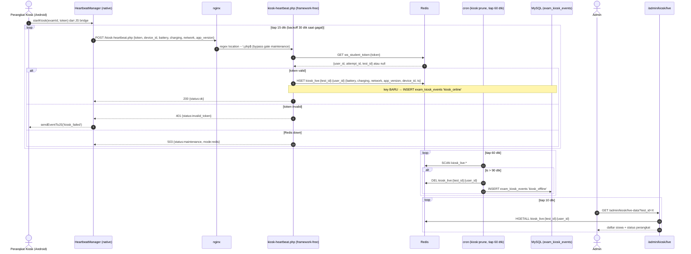

# Monitoring Kiosk Real-Time (Heartbeat + Dashboard Admin)

## 1. Overview & Goals

### 1.1 Deskripsi Singkat
Fitur ini menambahkan pemantauan **perangkat kiosk Android secara real-time** ke dalam CBT-MF. Perangkat kiosk mengirim *heartbeat* periodik (15 detik) berisi status perangkat (battery, jaringan, versi app) ke server. Admin melihat status seluruh perangkat per ujian melalui halaman dashboard baru dengan polling 10 detik.

### 1.2 Latar Belakang
Saat ini status kehadiran siswa hanya dideteksi melalui `active_sessions` (browser) dan WebSocket proctor (`proctor/live`). Tidak ada informasi kesehatan perangkat kiosk Android: baterai, koneksi jaringan, versi aplikasi, maupun deteksi perangkat yang berhenti mengirim data (mati, keluar kiosk, kehilangan jaringan). Keputusan yang sudah disepakati:

- Lokasi dashboard: **halaman admin baru** `/admin/kiosk/live` (dropdown per test aktif).
- Informasi per perangkat: status dot (hijau/kuning/abu), battery %, charging, tipe jaringan, versi app, terakhir terlihat.
- Riwayat: live view murni dari Redis; **audit transisi** online→offline ditulis ke `exam_kiosk_events` (tabel sudah ada).
- Autentikasi heartbeat: reuse `ws_student_token` (sudah digunakan `canExit`).

### 1.3 Sasaran (Goals)
1. **Deteksi cepat perangkat bermasalah:** dot status hijau (≤30 dtk), kuning/stale (30–90 dtk), abu-abu/offline (>90 dtk) tanpa refresh manual.
2. **Ringan untuk 1000 siswa / 2-core:** endpoint heartbeat bebas framework (tanpa bootstrap CI4), ~67 req/s dengan perkiraan ~0.2 core.
3. **Audit transisi:** peristiwa perangkat online dan offline tercatat di `exam_kiosk_events` untuk keperluan investigasi.
4. **Resiliensi outage:** saat Redis down, endpoint menjawab `503 {mode:redis}`; dashboard menampilkan banner via `maintenance-check.php`; kiosk WebView otomatis menampilkan halaman maintenance yang sudah ada.

---

## 2. Arsitektur Sistem

### 2.1 Komponen

| Komponen | Jenis | Tanggung Jawab |
|---|---|---|
| `HeartbeatManager.kt` | Baru (Android) | Timer 15 dtk, kirim payload, backoff, parse respons, integrasi KioskManager |
| `public/kiosk-heartbeat.php` | Baru (server, framework-free) | Terima heartbeat, validasi token, tulis Redis, audit online |
| `kiosk:prune` command | Baru (server) | Hapus key stale + audit offline |
| `KioskLiveController` + view `admin/kiosk/live.php` | Baru (server) | Halaman dashboard + endpoint data polling |
| `KioskManager.kt` | Ubah (Android) | Pass token/status ke HeartbeatManager |

---

## 3. Endpoint Heartbeat (`public/kiosk-heartbeat.php`)

### 3.1 Kontrak
- **Method/Path:** `POST /kiosk-heartbeat.php`
- **Body (JSON):** `{token: string, device_id: string, battery: int 0-100, charging: bool, network: "wifi"|"mobile"|"none", app_version: string}`
- **Respons:**
  - `200 {"status":"ok"}`
  - `401 {"status":"invalid_token"}` — token tidak ada/expired di Redis
  - `503 {"status":"maintenance","mode":"redis"}` — Redis tidak dapat dijangkau
- Selalu `Content-Type: application/json`, `Cache-Control: no-store`.

### 3.2 Logika (framework-free, mengikuti gaya `maintenance-check.php`)
1. Baca `php://input`, parse JSON; field wajib: `token`; lain-lain diisi nilai default bila absen.
2. Koneksi Redis via `new \Redis()` dengan env `REDIS_HOST/REDIS_PORT/REDIS_PASSWORD` (timeout 1.5 dtk), `try/catch` → gagal → `503 mode:redis`.
3. `GET ws_student_token:{token}` → parse JSON `{user_id, attempt_id, test_id}`; null/gagal parse → `401`.
4. `HSETNX kiosk_live:{test_id}:{user_id} ts {ts}` — jika menghasilkan `1` (key baru) → `INSERT` `exam_kiosk_events` (`event_type:'kiosk_online'`, `event_details` berisi device_id, battery, network, app_version), lalu `HSET` field sisanya. `HSETNX` membuat audit online bebas race (tanpa TOCTOU `EXISTS`+`HSET`).
5. Balas `200`.

### 3.3 Catatan
- Tidak perlu perubahan nginx: regex location `~ \.php$` sudah menangani file ini dan **tidak** terkena gate maintenance flag (verifikasi sebelumnya: `maintenance-check.php` bekerja). Ini disengaja: saat Redis down endpoint menjawab 503 sendiri; saat mode manual (Redis hidup) heartbeat tetap berjalan.
- Tidak ada session, tidak ada CI4 bootstrap → biaya per request minimal.

---

## 4. Audit Transisi (`kiosk:prune`)

- Command baru `App\Commands\KioskPrune` (`php spark kiosk:prune`), di-loop cron container tiap 60 dtk (docker-compose `cron` service, digabung dengan loop `finalize:expired` dan `redis:probe`).
- Key `kiosk_live:*` **tanpa TTL** (agar prune dapat menemukannya); field `ts` sebagai penanda.
- Algoritma: `SCAN` seluruh `kiosk_live:*` → `ts < now-90` → `DEL` + `INSERT exam_kiosk_events event_type='kiosk_offline'` dengan `event_details` berisi `{device_id, last_seen}`.
- `SCAN` setiap 60 dtk dengan 1000 siswa sangat ringan.
- Status dot di dashboard:
  - Hijau: `ts` ≤ 30 dtk lalu
  - Kuning (stale): 30 < `ts` ≤ 90 dtk
  - Abu-abu (offline): key tidak ada

---

## 5. Dashboard Admin (`/admin/kiosk/live`)

### 5.1 Halaman
- Route baru (group admin, auth admin): `GET admin/kiosk/live` → `Admin\KioskLiveController::index`; `GET admin/kiosk/live-data` → `::data`.
- View `src/app/Views/admin/kiosk/live.php` (Alpine.js, gaya `proctor/live.php`).
- Isi:
  - Dropdown **test aktif** (test dengan attempt berstatus berjalan/aktif; label nama + tanggal).
  - Tabel siswa (dari `test_attempts` JOIN `users` untuk test terpilih): nama, status dot, battery (icon + %), charging, jaringan (icon), versi app kiosk, device_id (disingkat), terakhir terlihat (relatif).
  - Empty state bila tidak ada attempt.
  - Banner:
    - Polling `maintenance-check.php` (10 dtk): `mode=redis` → banner merah "Redis tidak tersedia — data mungkin kedaluwarsa"; `mode=manual` → banner kuning.
    - Auto-refresh data tiap 10 dtk (`setInterval` + fetch `live-data`).

### 5.2 Endpoint Data (`live-data`)
- Auth admin + CSRF (konsisten pola admin lain).
- Input: `test_id` (required, valid).
- Keluaran JSON: `{test: {...}, students: [{user_id, name, status: "online"|"stale"|"offline", battery, charging, network, app_version, device_id, last_seen}]}`.
- Perhitungan status: baca `HGETALL kiosk_live:{test_id}:{user_id}` per siswa attempt; bandingkan `ts` (aturan §4).

---

## 6. Sisi Android (`HeartbeatManager.kt`)

- Class baru di package `kiosk` (atau `net`), dipakai `KioskManager`:
  - `startKiosk(examId, token)` → mulai; `stopKiosk()` → stop.
  - Token hanya di memori (konsisten dengan `KioskManager.currentToken`; tidak dipersist).
- Timer: `Handler.postDelayed`/Coroutine, interval 15 dtk; saat respons `503`/jaringan error → backoff 30 dtk (1x pengulangan); `401` → berhenti + `sendEventToJS('kiosk_failed', ...)`.
- Payload diambil dari state yang sudah ada: battery/charging dari receiver MainActivity (diakses via state bersama atau di-duplikasi pembacaan sederhana), network dari `ConnectivityManager`, `app_version` dari `BuildConfig`.
- `HttpURLConnection` POST JSON, timeout 5 dtk, `device_id` dari `getOrCreateDeviceId()`.
- Tidak mengganggu alur exam: kegagalan heartbeat hanya dicatat di log native.

---

## 7. Error Handling & Resiliensi

| Skenario | Perilaku |
|---|---|
| Redis down | Endpoint `503 mode:redis`; kiosk backoff 30 dtk; dashboard banner merah; kiosk WebView menampilkan maintenance page (infrastruktur lama) |
| Token invalid/expired | `401`; kiosk berhenti heartbeat + `kiosk_failed` ke JS |
| Key stale > 90 dtk | `kiosk:prune` hapus + audit `kiosk_offline` |
| Network error kiosk | Backoff 30 dtk, lanjut coba |
| Mode manual aktif | Endpoint tetap `200` (Redis hidup); dashboard banner kuning |
| 1000 siswa bersamaan | ~67 req/s, endpoint bebas framework; prune `SCAN` tiap 60 dtk |

---

## 8. Testing

1. **Lint & syntax:** `php -l` semua file PHP baru/ubah; `docker compose config --quiet`.
2. **Simulasi endpoint (curl):**
   - Token valid: buat `ws_student_token:{token}` via `php -r` (Redis) → POST heartbeat → `200`; cek `kiosk_live:{test_id}:{user_id}` + event `kiosk_online` di DB.
   - Token invalid → `401`.
   - `docker stop ex_redis` → POST → `503 mode:redis`; `docker start ex_redis` → `200` kembali.
3. **Prune:** isi key dengan `ts` lama → jalankan `php spark kiosk:prune` manual → key hilang + event `kiosk_offline` tercatat.
4. **Dashboard:** login admin → halaman `live` → dropdown, tabel, banner (uji mode redis dengan stop redis, mode manual via toggle), polling 10 dtk.
5. **Android (manual):** build APK, pasang di kiosk, mulai ujian → cek log server heartbeat diterima, dashboard menampilkan perangkat (battery/network/versi), stop app kiosk → status abu-abu ≤2 menit.

## 9. Out of Scope (saat ini)

- Badge event keamanan terakhir per siswa di dashboard (data `kiosk_event` WS sudah ada; dapat ditambahkan kemudian).
- Monitoring siswa browser biasa (sudah ada `active_sessions`).
- Detail teknis lanjutan (RSSI WiFi, uptime, suhu baterai).
- Penambahan kolom ke tabel DB baru (tidak perlu — memakai `exam_kiosk_events` yang ada).
