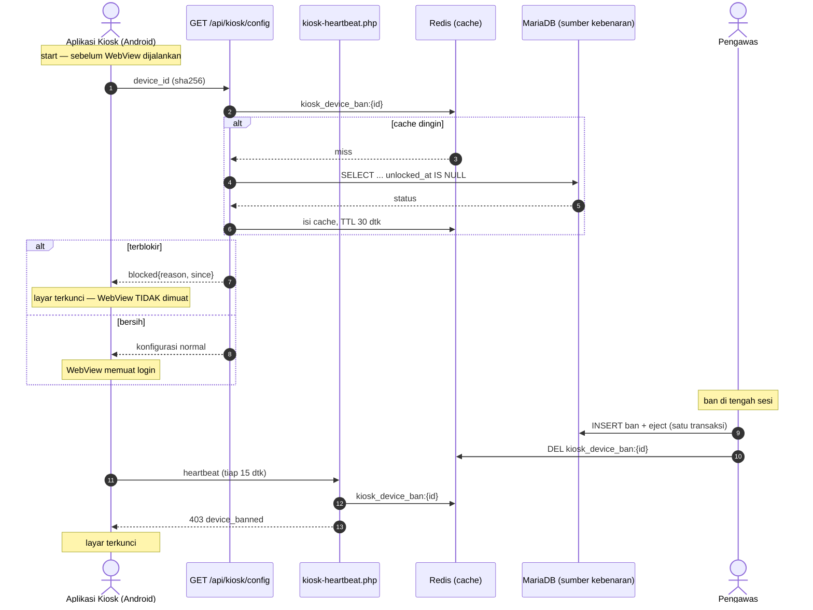

# Device Ban EXAMBRO (Blokir Perangkat, Bukan Akun)

## 1. Overview & Goals

### 1.1 Deskripsi Singkat

Pengawas dapat memblokir **satu perangkat** dari menjalankan aplikasi ujian sama
sekali. Perangkat yang diblokir tidak memuat halaman ujian, tidak menampilkan
layar login, dan tidak melanjutkan sesi yang sedang berjalan. Blokir bersifat
global dan bertahan sampai seseorang membukanya lewat tombol **Buka Kunci**.

Blokir menyasar perangkat, **bukan akun**. Siswa yang perangkatnya diblokir
tetap bisa melanjutkan ujian di perangkat lain bila pengawas mengizinkan.

### 1.2 Latar Belakang

`device_id` sudah mengalir di sistem ini tetapi tidak pernah menegakkan apa pun:
aplikasi mengirimnya tiap heartbeat, `kiosk-heartbeat.php` menyimpannya di
`kiosk_live:{testId}:{userId}`, `exam_kiosk_events` mencatatnya pada heartbeat
pertama, dan `/admin/kiosk/live` menampilkannya terpotong 8 karakter. Satu-satunya
kendali yang ada saat ini adalah per-akun (`ProctorAction::eject` dan
`lockAccount`), yang tidak menyentuh perangkatnya sama sekali.

Keputusan yang sudah disepakati:

| Topik | Keputusan |
|---|---|
| Pemicu ban | **Hanya manual** oleh pengawas. Sistem tidak pernah nge-ban sendiri. |
| Jangkauan | **Global**, berlaku untuk semua ujian, sampai dibuka. |
| Sesi berjalan | Ban **sekaligus eject** sesi saat itu. Akun **tidak** dikunci. |
| Identitas | `ANDROID_ID` yang di-hash. Bukan UUID per-pemasangan. |
| Rilis | Server **dan** APK baru. Penegakan sejati butuh keduanya. |
| Wewenang unlock | Sama dengan yang bisa nge-ban. |

### 1.3 Sasaran

1. **Perangkat terblokir tidak memuat apa pun.** Bukan "login lalu ditolak" —
   WebView tidak pernah dijalankan.
2. **Blokir bertahan melewati hapus data aplikasi dan pasang ulang.** UUID per
   pemasangan gagal di sini, dan friction-nya terlalu murah: aplikasi kiosk ini
   sekadar pengambil konten, memasang ulangnya hal biasa.
3. **Identitas perangkat tidak bisa dipakai untuk apa pun selain mencocokkan.**
   Lihat §4.
4. **Perangkat yang lupa dibuka tidak menghilang dari pandangan.** Perangkat
   sekolah dipakai bergilir; ban yang terlupakan mengunci siswa berikutnya.
5. **APK lama tetap berfungsi**, hanya tidak menegakkan di titik paling awal.

### 1.4 Bukan Sasaran

- **Bukan** deteksi kecurangan otomatis. Tidak ada jalur yang menghasilkan ban
  tanpa keputusan manusia.
- **Bukan** attestation perangkat, deteksi root sebagai gerbang, atau inventaris
  perangkat. Konsisten dengan `KioskPresence` yang sengaja tidak bergantung pada
  deteksi root karena perangkat uji sekolah ini memang di-root.
- **Bukan** pengganti `lockAccount`. Keduanya hidup berdampingan untuk maksud
  yang berbeda.

---

## 2. Arsitektur Sistem



### 2.1 Kenapa dua titik penegakan, bukan tiga

`/api/kiosk/config` adalah yang menjawab permintaan inti — halaman tidak termuat.
`kiosk-heartbeat.php` adalah jaring untuk dua kasus yang tidak tertangkap titik
pertama: perangkat yang diblokir **setelah** aplikasi berjalan, dan APK lama yang
belum mengirim `device_id` ke `config`.

Pemeriksaan di endpoint login **sengaja tidak ditambahkan**. Kalau aplikasi tidak
memuat halamannya, login tidak pernah terjadi. Lapis ketiga hanya menambah
permukaan tanpa menutup celah yang nyata.

---

## 3. Strategi Pembacaan (DB sumber kebenaran, Redis cache)

`kiosk-heartbeat.php` adalah jalur terpanas: tiap perangkat mengetuk tiap 15
detik, jadi 500 perangkat berarti ~33 pemeriksaan per detik terhadap data yang
nyaris tidak pernah berubah.

**Sumber kebenaran ada di MariaDB.** Cache Redis per-perangkat
`kiosk_device_ban:{device_id}` menyimpan `'1'`/`'0'` dengan TTL 30 detik.

- Cache dingin → jatuh ke DB → isi cache. Tetap benar, hanya lebih lambat.
- Menulis ban atau unlock **menghapus** kunci cache perangkat itu, sehingga
  keduanya berlaku seketika, bukan setelah TTL habis.
- Redis mati → langsung ke DB. Tanpa cache sistem tetap benar.

**Redis sengaja tidak dijadikan sumber kebenaran.** `cbt.sh redis flush` adalah
perintah yang memang ada dan memang dipakai; kalau ban hanya hidup di Redis,
perintah itu akan **membuka semua blokir tanpa suara**. Kendali keamanan tidak
boleh punya jalur gagal-terbuka yang sunyi.

---

## 4. Identitas Perangkat

### 4.1 Masalah dengan identitas yang sekarang

`MainActivity.getOrCreateDeviceId()` memakai `UUID.randomUUID()` yang disimpan di
SharedPreferences. Nilai itu lenyap saat data aplikasi dihapus atau aplikasi
dipasang ulang — friction yang terlalu murah untuk sebuah aplikasi yang memang
biasa dipasang ulang.

### 4.2 Yang dipakai

```kotlin
// Android 8+ menyekat ANDROID_ID per kunci tanda tangan aplikasi, jadi nilai
// yang sama TIDAK terlihat oleh aplikasi lain mana pun. minSdk proyek ini 28,
// sehingga penyekatan itu berlaku di seluruh perangkat yang didukung.
val raw = Settings.Secure.getString(contentResolver, Settings.Secure.ANDROID_ID)
```

Yang dikirim ke server bukan nilai itu, melainkan:

```
device_id = sha256("cbt-mf|" + ANDROID_ID)      // 64 karakter heksadesimal
```

### 4.3 Kenapa di-hash

Batas "hanya penanda, tidak lebih" ditegakkan **secara konstruksi, bukan lewat
janji**. Karena nilai aslinya tidak pernah sampai ke server:

- Server hanya bisa membandingkan sama atau tidak sama. Tidak ada operasi lain
  yang mungkin dilakukan terhadap nilai itu.
- Nilainya tidak bisa dibalik menjadi identitas perangkat, dan tidak bisa
  dijoin dengan sumber data mana pun.
- Bocornya basis data tidak membocorkan identifier perangkat.
- Prefiks `"cbt-mf|"` mengunci nilai ke aplikasi ini.

sha256 heksadesimal panjangnya tepat 64 karakter — muat persis di `VARCHAR(64)`,
lolos `substr(..., 0, 64)` yang sudah ada di `kiosk-heartbeat.php`, dan lolos
saringan `[a-zA-Z0-9_-]` di `KioskController`.

### 4.4 Penanganan tepi

| Kondisi | Perlakuan |
|---|---|
| `ANDROID_ID` kosong atau null | Tidak sah → jatuh ke UUID per-pemasangan yang lama |
| Nilai kembar terkenal `9774d56d682e549c` | Tidak sah → jatuh ke UUID |
| Panjang bukan 16 heksadesimal | Tidak sah → jatuh ke UUID |

Pada jalur cadangan, ban tetap berfungsi — hanya lebih lemah untuk perangkat itu,
karena kembali bisa dilepas dengan menghapus data aplikasi.

### 4.5 Batas yang jujur

Perangkat yang di-root **masih bisa** mengubah `ANDROID_ID`, dan factory reset
mengembalikannya. Perangkat uji sekolah ini di-root, jadi ini bukan hipotesis.
Yang dibeli oleh perubahan ini adalah lompatan friction dari "hapus data
aplikasi" ke "root perangkat atau factory reset" — bukan sebuah tembok.

Ini konsisten dengan sikap yang sudah dianut `KioskPresence`: menutup jalur
termudah, mencatat setiap penyimpangan, dan tidak berpura-pura menutup semuanya.

### 4.6 Catatan migrasi

Setelah APK diperbarui, format `device_id` berubah dari UUID menjadi hash 64
heksadesimal. Belum ada ban sama sekali sehingga tidak ada data yang rusak,
tetapi baris lama di `kiosk_live:*` dan `exam_kiosk_events` tidak akan cocok
dengan yang baru. Tidak ada backfill: nilai lama tidak bisa dipetakan ke nilai
baru, dan memang tidak perlu.

---

## 5. Model Data

Migrasi baru `2026-08-26-000001_CreateKioskBannedDevicesTable.php`:

```
kiosk_banned_devices
  id            INT UNSIGNED  PK AUTO_INCREMENT
  device_id     VARCHAR(64)   NOT NULL     -- sha256 hex, atau UUID pada jalur cadangan
  reason        VARCHAR(255)  NOT NULL     -- wajib diisi pengawas
  banned_by     INT UNSIGNED  NOT NULL     -- users.id
  banned_at     DATETIME      NOT NULL
  unlocked_by   INT UNSIGNED  NULL
  unlocked_at   DATETIME      NULL
  last_user_id  INT UNSIGNED  NULL         -- konteks: siapa yang memakai saat di-ban
  last_test_id  INT UNSIGNED  NULL         -- konteks: ujian mana

  KEY idx_device_active (device_id, unlocked_at)
```

**Ban aktif = baris dengan `unlocked_at IS NULL`.** Baris lama tidak dihapus saat
unlock, sehingga riwayat "perangkat ini sudah tiga kali diblokir" terbaca.

MariaDB tidak punya indeks unik parsial, jadi jaminan "paling banyak satu ban
aktif per perangkat" ditegakkan di lapisan aplikasi: penulisan ban memeriksa ban
aktif lebih dulu di dalam transaksi yang sama.

`last_user_id` dan `last_test_id` disimpan sebagai konteks kejadian, bukan
sebagai kunci. Ban tidak pernah menyempit ke satu siswa atau satu ujian.

---

## 6. Penegakan

### 6.1 `GET /api/kiosk/config`

Menerima `device_id` (parameter kueri). Bila terblokir, balasannya tetap
**HTTP 200** dengan konfigurasi normal seperti biasa, ditambah satu field:

```json
{ "blocked": { "reason": "...", "since": "2026-08-26 09:14:00" } }
```

Sengaja 200 dan bukan 403, karena dua alasan. Pertama, konfigurasi normal ikut
terkirim sehingga layar terkunci masih bisa menampilkan nama sekolah dan logo
alih-alih layar kosong. Kedua, status galat mengundang aplikasi memperlakukannya
sebagai gangguan jaringan lalu mencoba ulang — padahal ini keputusan yang sudah
final dan bukan kegagalan.

Aplikasi menampilkan layar terkunci dan **tidak pernah menjalankan WebView**.

Bila `device_id` tidak dikirim (APK lama), `config` menjawab seperti sekarang —
kompatibel mundur, dan perangkat itu tertangkap di §6.2 beberapa detik kemudian.

### 6.2 `kiosk-heartbeat.php`

Sudah menerima `device_id` hari ini. Bila terblokir, jawab `403`:

```json
{ "status": "device_banned", "reason": "..." }
```

dan **jangan tulis** `kiosk_live:*`. Aplikasi menanggapinya dengan layar terkunci
yang sama.

Endpoint ini bebas framework dengan sengaja. Ia memakai koneksi Redis dan PDO
yang sudah dimilikinya; tidak ada bootstrap CI4 yang ditambahkan.

Karena heartbeat berhenti menulis, `kiosk_live` menjadi basi dan
`KioskPresence::check()` menolak tulisan jawaban setelah `STALE_SECONDS`. Itu
lapis ketiga yang datang gratis, bukan kode baru.

---

## 7. Aksi Pengawas

### 7.1 Blokir

Menu aksi di `/admin/kiosk/live` mendapat **Blokir Perangkat**. Alasan wajib
diisi. Satu transaksi:

1. Simpan baris ban (`last_user_id`, `last_test_id` dari baris monitoring)
2. `ProctorAction::eject(...)` untuk sesi yang sedang berjalan
3. Hapus kunci cache Redis perangkat itu
4. `ActivityLogModel` mencatat `device_ban`

**Akun tidak dikunci.** Pemisahan ini disengaja: "perangkat ini bermasalah"
bukan "siswa ini dihukum". Pengawas yang memang ingin mengunci akun tetap punya
`lock` dan `eject_lock` yang sudah ada.

Tombol dinonaktifkan bila baris itu belum melaporkan `device_id` — APK lama tidak
punya yang bisa diblokir, dan tombol yang gagal diam-diam lebih buruk daripada
tombol yang jelas mati.

### 7.2 Buka Kunci

Halaman baru `/admin/kiosk/devices` mendaftar perangkat yang sedang terblokir:
ID (terpotong), alasan, siapa yang mengunci, kapan, dan pemakai terakhir. Tiap
baris punya tombol **Buka Kunci**, yang mengisi `unlocked_by`/`unlocked_at`,
menghapus kunci cache, dan mencatat `device_unban`.

Wewenangnya sama dengan yang bisa nge-ban. Perangkat terkunci di tengah sesi
tanpa ada orang berwenang yang bisa membukanya jauh lebih berbahaya daripada
unlock yang terlalu mudah.

Jumlah perangkat terblokir juga muncul sebagai lencana di `/admin/kiosk/live`,
supaya perangkat bergilir yang lupa dibuka tidak menghilang dari pandangan
(sasaran §1.3 nomor 4).

---

## 8. Perubahan APK

Dua perubahan kecil di sisi native:

1. `getOrCreateDeviceId()` menurunkan nilai dari `ANDROID_ID` sesuai §4, dengan
   jalur cadangan §4.4. Nilai hasilnya tetap disimpan di SharedPreferences
   sebagai cache supaya tidak dihitung ulang tiap heartbeat.
2. Saat start, `/api/kiosk/config` dipanggil dengan `device_id`, dan balasan
   `blocked` menampilkan layar terkunci alih-alih menjalankan WebView. Layar itu
   menampilkan alasan dan instruksi menghubungi pengawas.

`getDeviceInfo()` di `CommsBridge` **tidak** diubah. Halaman login tidak
memerlukan `device_id` karena tidak ada pemeriksaan di sisi login (§2.1).

---

## 9. Penanganan Galat

| Kondisi | Perilaku |
|---|---|
| Redis mati saat memeriksa ban | Langsung ke DB. Penegakan tetap jalan. |
| DB mati saat memeriksa ban | Seluruh situs sudah masuk maintenance lewat `deps:probe`. Tidak ada jalur baru. |
| `device_id` kosong di `config` | Diperlakukan sebagai APK lama: lolos, tertangkap di heartbeat. |
| `device_id` melebihi 64 karakter atau memuat karakter di luar `[a-zA-Z0-9_-]` | Ditolak sebagai masukan tidak sah, diperlakukan seperti tidak dikirim. |
| Ban ditulis untuk perangkat yang sudah punya ban aktif | Tidak menambah baris; alasan diperbarui dan aksi tetap tercatat di log. |
| Unlock untuk perangkat yang sudah terbuka | Idempoten, tidak error. |

---

## 10. Pengujian

Suite `Resilience` yang sudah ada (`src/tests/Resilience/`) jadi tempatnya, karena
bootstrap tesnya sudah berjalan tanpa framework.

1. Perangkat terblokir ditolak; perangkat bersih lolos.
2. Unlock mengembalikan akses.
3. Ban dan unlock **membatalkan cache seketika** — bukan menunggu TTL habis.
4. **Cache dingin jatuh ke DB, bukan gagal-terbuka.** Ini yang paling penting:
   ia menjaga agar `redis flush` tidak pernah diam-diam membuka semua blokir.
5. Derivasi identitas: `ANDROID_ID` sah menghasilkan hash stabil sepanjang 64;
   nilai kosong, `9774d56d682e549c`, dan nilai cacat jatuh ke UUID.
6. Ban kedua untuk perangkat yang sama tidak menghasilkan dua baris aktif.

Verifikasi manual yang tidak bisa diotomatiskan: rollout APK ke satu perangkat
nyata, blokir dari monitoring, pastikan aplikasi menampilkan layar terkunci dan
WebView tidak dimuat, lalu buka kunci dan pastikan aplikasi kembali normal.

---

## 11. Berkas Terdampak

**Baru**
- `src/app/Database/Migrations/2026-08-26-000001_CreateKioskBannedDevicesTable.php`
- `src/app/Models/KioskBannedDeviceModel.php`
- `src/app/Libraries/DeviceBan.php` — pemeriksaan, penulisan, pembatalan cache
- `src/app/Controllers/Admin/KioskDeviceController.php`
- `src/app/Views/admin/kiosk/devices.php`
- `src/tests/Resilience/DeviceBanTest.php`

**Diubah**
- `src/app/Controllers/Api/KioskController.php` — `config()` menerima `device_id`
- `src/public/kiosk-heartbeat.php` — tolak 403 bila terblokir
- `src/app/Controllers/Admin/KioskLiveController.php` — aksi `ban_device`
- `src/app/Views/admin/kiosk/live.php` — tombol dan lencana
- `src/app/Config/Routes.php` — rute `/admin/kiosk/devices`
- `cbt-kiosk-app/.../MainActivity.kt` — derivasi identitas dan layar terkunci

Bundle UI **tidak** berubah, jadi `cbt:build-ui-bundle` tidak diperlukan.
